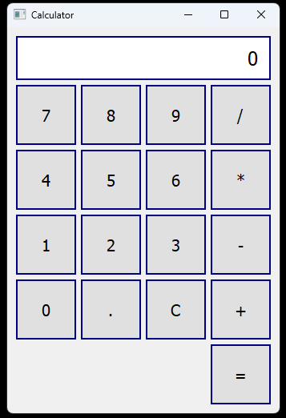

# Python Calculator App

The Python Calculator App is a simple calculator application written in Python, featuring a user-friendly graphical user interface (GUI) implemented with PyQt5. This project follows the MVVM (Model-View-ViewModel) architectural pattern, providing a clear separation of concerns between the application's logic and its presentation.



## Prerequisites

Before getting started with the Python Calculator App, make sure you have the following prerequisites installed:

- Python 3.x: You can download Python from the official website [here](https://www.python.org/downloads/).
- PyQt5: You can install PyQt5 using pip by running the following command:
  ```
  pip install PyQt5
  ```

## Getting Started

Follow these steps to get started with the Python Calculator App:

1. Clone this Repository:
   ```
   git clone <repository_url>
   ```
   Replace `<repository_url>` with the URL of your project's Git repository.

2. Install PyQt5:
   ```
   pip install PyQt5
   ```

3. Run the Application:
   ```
   python main.py
   ```
   This command will start the Python Calculator App, and the calculator GUI will appear on your screen.

## Features

- User-friendly graphical user interface (GUI) for performing basic arithmetic calculations.
- Supports addition (+), subtraction (-), multiplication (*), and division (/) operations.
- Clear button (C) to reset the calculator display.
- Error handling for division by zero and invalid operations.

## How to Use

1. Launch the Python Calculator App by running `python main.py`.

2. Calculator Interface:
   - The calculator provides a numeric keypad (0-9), decimal point (.), and arithmetic operation buttons (+, -, *, /).
   - The display at the top shows the current input and calculated result.

3. Performing Calculations:
   - Click the numeric buttons to input numbers. You can enter continuous digits for the first operand (a).
   - To perform an operation, click one of the operation buttons (+, -, *, /). The first operand (a) is hydrated with the current input, and you can enter the second operand (b).
   - After entering the second operand (b), click the "=" button to calculate the result.
   - To clear the input and start over, click the "C" button.

4. Error Handling:
   - If you attempt to divide by zero, the display will show "Error," indicating an invalid operation.

## Architecture

The Python Calculator App follows the MVVM (Model-View-ViewModel) architectural pattern:

- **Model**: The `CalculatorModel` handles the business logic and performs arithmetic operations.
- **View**: The `CalculatorView` class defines the graphical user interface using PyQt5.
- **ViewModel**: The `CalculatorViewModel` acts as a mediator between the Model and View, handling user interactions and calculations.

## License

This project is licensed under the [MIT License](LICENSE).

## Acknowledgments

- [PyQt5 Documentation](https://doc.qt.io/qtforpython/): Official documentation for PyQt5.
- [Python](https://www.python.org/): The programming language used for this project.